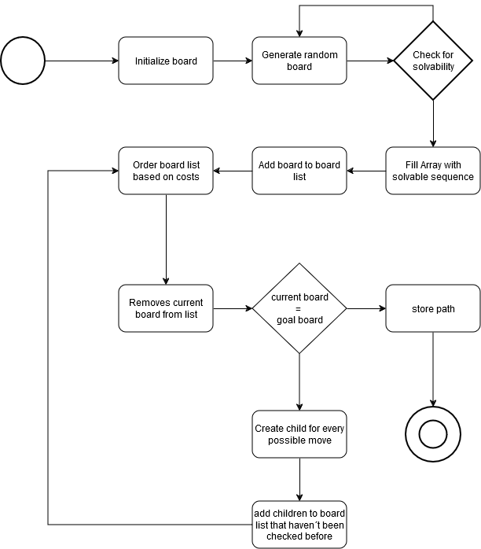
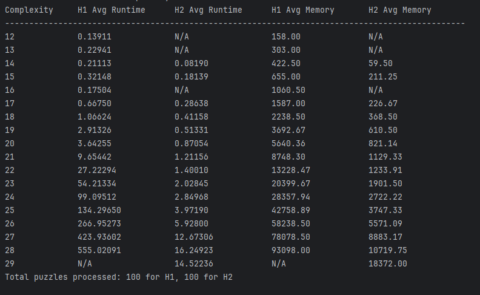

# Documentation

## Task Description

    The task involves implementing an 8-puzzle solver using the A* search algorithm.
    This is to be implemented with the help of the Hamming and Mannhattan heuristic.
    These two approaches should then be compared on the basis of memory usage and computation time by using 100 ramdom searches each.
    The project consists of three Modules: 
    Board.py: Defines the Board class for managing board states, heuristic calculations, and transitions.
    Game.py: Contains the Game class, which organizes A* search execution and maintains the solution path.
    UE1_main.py: Main script for initialization, execution, and result display.

## Software architecture diagram

## Classes

### Board (Board.py)

    Represents a single board state.

    Attributes:
        array: Current board configuration.
        goal: Target configuration.
        cost: Steps taken to reach the state.
        heuristic_estimate: Value based on the heuristic method.
        overall_cost: Combined cost (A* function value f(n)).
        children: List of valid child states.
        parent: Pointer to the previous board state.

    Methods:
        initBoard: Initializes a random solvable board.
        is_solvable: Verifies solvability of the board.
        printBoard: Print the current board.
        h1: Computes Hamming distance.
        h2: Computes Manhattan distance.
        switch_x_and_0: Move one value to the empty position.
        possible_moves: Identifies tiles that can be swapped with the blank.
        update_cost: Updates the overall cost for the board state.

### Game (Game.py)

    Manages the search process for a solution.

    Attributes:
        heuristic_method: Chosen heuristic ("h1" or "h2").
        board_states: The closed set (Already processed boards/states).
        root_board: Starting board state.
        solution_board: Final solved board state.
        list_of_boards: Open Set (list of boards/states for exploration).

    Methods:
        explore_child_boards: Expands child states from a parent.
        find_solution: Executes the A* search algorithm.
        print_shortest_path: Displays the path from the initial to the solved state.

## Data Structures

    Board:
        2D numpy array.
        Attributes for tracking cost, parent, and children.
    Game:
        List of Board objects for managing states.
        Set for tracking explored states.

## Fundamental Design Decisions

    Data Structures: 
        numpy arrays for efficient board operations.
        Sets to track explored states, avoiding redundancy.

    Class Hierarchy:
        Logical division of functionalities into board, game and main.
            Main is responsible for starting the solution search and for entering the basic conditions (which heuristics, how many fields should be created, ...).
            Board is responsible for creating new boards based on the distances.
            Game is responsible for finding the solution and its flow.

## Fundamental Concepts

    Admissible Heuristics: Ensure that the heuristic never overestimates the cost to the goal.
    Search Trees: Represent states and transitions as nodes and edges.
    Priority Queues: Manage the open list efficiently.
    A* Search: Combines the actual cost to reach a node (g(n)) with an estimated cost to the goal (h(n)).
               f(n) = g(n) + h(n)
    A* Search steps:
        Initialize open and closed lists.
        Expand the node with the smallest f(n).
        Generate children, calculate their costs, and add unexplored states to the open list.
        Repeat until the goal is reached or no states remain.

## Discussion and Conclusions

    Experimental Observations:
        Manhattan heuristic performs better for deeper solutions due to finer granularity.
        Memory usage scales with problem depth.

    Complexity Comparison:
        Manhattan is computationally more expensive but reduces total explored states.

    Alternatives and Improvements:
        Implement multithreading to be able to solve several fields simultaneously.